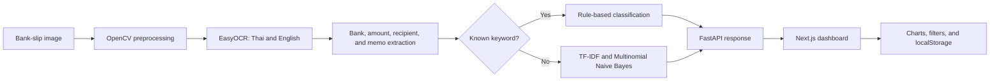

# SaiJai Analytics

SaiJai is an AI-assisted expense analytics application that turns Thai bank-slip images into structured transactions and visual spending insights. It combines OCR, Thai natural-language processing, lightweight machine learning, and an interactive web dashboard.


## Overview

Recording expenses manually is repetitive when the required information already exists on transfer slips. SaiJai lets users upload slip images, extracts their key fields, predicts an expense category, and adds the results to a searchable analytics dashboard.

The dashboard includes 100 synthetic transactions from five Thai banks, so its charts, filters, and automatic insights can be explored without uploading real financial documents.

> All sample records are synthetic. Their recipients, references, amounts, and transactions do not represent real people or payments.

## Key features

- Upload JPG, PNG, WebP, and HEIC bank-slip images up to 10 MB
- Improve OCR input with grayscale conversion, CLAHE, denoising, and Otsu thresholding
- Read Thai and English text with EasyOCR
- Extract the bank, transferred amount, recipient, and transaction memo
- Classify expenses into nine categories with keyword rules and machine learning
- Display a confidence score for each AI classification
- Analyze total spending, average spending, largest transactions, top categories, and top banks
- Visualize daily trends, category distribution, and spending by bank
- Filter analytics by bank and by the latest 30 or 90 days
- Search transaction history by recipient, memo, bank, or reference
- Download the sample dataset as CSV
- Store transaction history locally in the browser
- Use a responsive interface across desktop, tablet, and mobile devices

## Sample dataset

The included dataset contains 100 records, with 20 transactions from each bank.

| Code | Bank | Records |
| --- | --- | ---: |
| KBank | Kasikornbank | 20 |
| SCB | Siam Commercial Bank | 20 |
| KTB | Krungthai Bank | 20 |
| BBL | Bangkok Bank | 20 |
| BAY | Bank of Ayudhya (Krungsri) | 20 |

Each record contains a date, bank, amount, memo, recipient, category, confidence score, synthetic reference, and sample-data flag.

Dataset files:

- `data/slip_transactions.csv` — source dataset for further analysis
- `frontend/data/sample-transactions.json` — dataset loaded by the dashboard
- `frontend/public/data/slip-transactions.csv` — downloadable CSV exposed by the frontend

The data is deterministic and can be regenerated with:

```bash
python3 data/generate_sample_data.py
```

## How it works



The classifier first checks high-confidence keyword rules. If no rule matches, it falls back to a TF-IDF vectorizer and Multinomial Naive Bayes model. The API returns both the predicted category and its confidence score.

## Technology stack

| Area | Technologies |
| --- | --- |
| Frontend | Next.js 16, React 19, TypeScript, Tailwind CSS 4 |
| Data visualization | Recharts |
| Backend API | Python 3.10, FastAPI, Uvicorn |
| OCR | EasyOCR |
| NLP and machine learning | PyThaiNLP, scikit-learn, TF-IDF, Multinomial Naive Bayes |
| Image processing | OpenCV, NumPy |
| Client storage | Browser localStorage |

## Project structure

```text
Project-saijai/
├── backend/
│   ├── main.py                      # OCR, extraction, classification, and API
│   └── requirements.txt
├── data/
│   ├── generate_sample_data.py      # Reproducible synthetic-data generator
│   └── slip_transactions.csv        # 100 sample transactions
└── frontend/
    ├── app/
    │   ├── globals.css
    │   ├── layout.tsx
    │   └── page.tsx                 # Dashboard, upload, and history interface
    ├── data/
    │   └── sample-transactions.json
    └── public/data/
        └── slip-transactions.csv
```

## Getting started

### 1. Clone the repository

```bash
git clone https://github.com/AriyaLuesawat/Project-saijai.git
cd Project-saijai
```

### 2. Start the backend

Python 3.10 is recommended. The first OCR request may take longer while EasyOCR loads or downloads its models.

```bash
cd backend
python3 -m venv venv
source venv/bin/activate
python -m pip install --upgrade pip
python -m pip install -r requirements.txt
uvicorn main:app --reload --port 8000
```

Check the API at `http://localhost:8000/health`. Interactive API documentation is available at `http://localhost:8000/docs`.

### 3. Start the frontend

Open another terminal:

```bash
cd frontend
npm ci
npm run dev
```

Open `http://localhost:3000`. The dashboard loads the 100 sample transactions automatically.

The frontend connects to `http://localhost:8000` by default. To use another backend, create `frontend/.env.local`:

```env
NEXT_PUBLIC_API_URL=https://your-api.example.com
```

## API reference

### Health check

```http
GET /health
```

Example response:

```json
{
  "status": "ok",
  "version": "2.0.0"
}
```

### Analyze a slip

```http
POST /analyze-slip/
Content-Type: multipart/form-data
```

Send one image in a form field named `file`.

Example response:

```json
{
  "status": "success",
  "data": {
    "bank_name": "KBank (Kasikornbank)",
    "amount": "250.00",
    "memo": "Lunch",
    "recipient": "Sample Restaurant",
    "category": "Food",
    "confidence": 1.0
  }
}
```

## Quality checks

```bash
cd frontend
npm run lint
npx tsc --noEmit
npm run build
```

## Current limitations

- The category classifier uses a small in-code vocabulary and has not yet been evaluated on a public labeled dataset.
- Amount extraction selects the largest value with two decimal places, which may be incorrect for some slip layouts.
- Transaction history is stored only in the current browser and is removed when site data is cleared.
- OCR runs on the CPU, so response time depends on image size and system performance.
- The API currently permits all CORS origins and should be restricted before production deployment.

## Roadmap

- Add a database and user authentication
- Add anonymized OCR fixtures and automated extraction tests
- Evaluate classification precision, recall, and F1 score
- Mask sensitive information before storage or logging
- Add automated CI/CD workflows
- Add monthly reports and budget tracking

## Author

**Ariya Luesawat**<br>
Artificial Intelligence and System Engineering student<br>
Prince of Songkla University, Phuket Campus

- [GitHub](https://github.com/AriyaLuesawat)
- [LinkedIn](https://linkedin.com/in/ariya-luesawat-bb6280419)

## License

This project was created for educational work and experimentation with OCR, NLP, machine learning, and data visualization.
